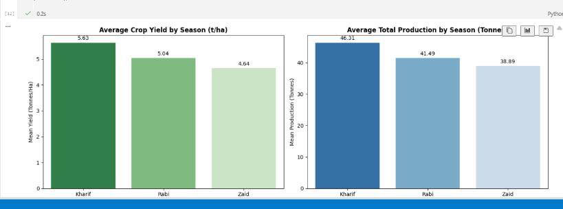
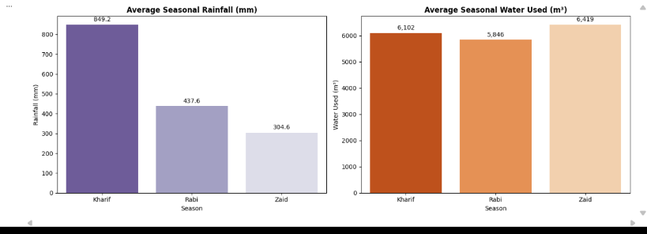
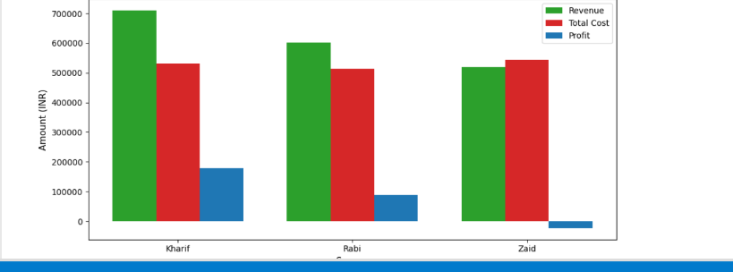
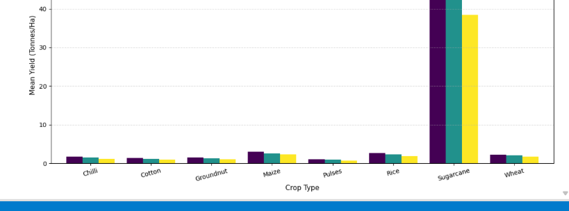

# Seasonal Agriculture Performance Analysis

## Overview
This project presents a data analytics study on agricultural performance variations across the three primary Indian cropping seasons: **Kharif**, **Rabi**, and **Zaid**. Utilizing environmental, resource usage, crop production, and economic datasets, the analysis provides empirical insights into seasonal productivity, resource efficiency, and profitability patterns.

## Problem Statement
Raw agricultural datasets often obscure critical seasonal dynamics and cross-variable patterns. Standard tabular data without systematic exploratory analysis fails to clearly highlight seasonal variations in crop yields, production volumes, resource utilization, environmental conditions, and economic returns. This project addresses the gap by analyzing seasonal performance metrics to aid data-driven agricultural decision-making.

## Objectives
- Explore and systematically understand the agricultural performance dataset.
- Clean and prepare the data for exploratory and statistical analysis.
- Compare agricultural performance across Kharif, Rabi, and Zaid seasons.
- Identify distinct seasonal patterns and operational trends.
- Analyze relationships between environmental/resource factors and agricultural outcomes.
- Compare crop types and irrigation methods across different seasons.
- Apply statistical analysis to validate important findings.
- Formulate evidence-based observations and practical recommendations.

## Dataset
The project analyzes `seasonal_agriculture_performance_dataset.csv`, which contains **4,000 records** and **28 columns** covering:
- Crops and locations
- Environmental conditions
- Farming practices and resource usage
- Yield and production
- Revenue, cost, and profit
- Water usage and water efficiency
- Disease/pest risk

## Technologies Used
- **Python**
- **Jupyter Notebook**
- **Pandas**
- **NumPy**
- **Matplotlib**
- **Seaborn**
- **SciPy**
- **CSV dataset**

## Project Workflow
```text
Data Understanding ──> Data Cleaning ──> Exploratory Analysis ──> Seasonal Performance Analysis ──> Relationship & Group Analysis ──> Statistical Analysis ──> Findings & Recommendations
```

## Results and Visual Analysis

### 8.1 Seasonal Yield and Production Analysis
This analysis compares average crop yield and average total production across Kharif, Rabi, and Zaid seasons.



### 8.2 Seasonal Rainfall and Water Usage Analysis
This analysis compares seasonal rainfall and water usage patterns.



### 8.3 Seasonal Economic Performance Analysis
This analysis compares seasonal revenue, total cost, and profit.



### 8.4 Crop Performance Across Seasons
This analysis compares average crop yield across different seasons to identify crop-level seasonal variations.



## Key Findings
- Kharif recorded the highest average yield among the three seasons.
- Kharif showed the strongest observed average profitability.
- Zaid recorded the lowest average yield and negative average profit in the analyzed data.
- Rainfall and soil moisture were higher in Kharif, while Zaid had lower rainfall and higher average temperature.
- Water usage showed a statistically significant positive association with yield (Pearson r ≈ 0.386, p < 0.001).
- Seasonal profit differences were statistically significant based on one-way ANOVA.
- Seasonal yield differences were not statistically significant at the 5% significance level.
- Drip irrigation was associated with higher observed average yield than some other irrigation methods; this should be described as an association, not a causal effect.

## Recommendations
- Consider seasonal conditions when planning crops.
- Improve irrigation management, especially during drier seasons.
- Consider efficient irrigation methods such as drip irrigation.
- Consider lower-water or short-duration crops for higher-risk seasons such as Zaid.
- Consider soil moisture conservation practices.

## Future Scope
- Larger historical datasets
- Weather and soil data integration
- Resource optimization
- Seasonal risk identification
- Future predictive analysis using machine learning

*Note: Machine learning is planned for future scope and was NOT implemented in this project.*

## Project Structure
```text
Seasonal_Agriculture_Performance_Analysis/
├── images/
│   ├── crop_yield_by_season.png
│   ├── seasonal_economic_comparison.png
│   ├── seasonal_rainfall_water_usage.png
│   └── seasonal_yield_production.png
├── Seasonal_Agriculture_Performance_Analysis.ipynb
├── seasonal_agriculture_performance_dataset.csv
├── README.md
└── .gitignore
```

## How to Run
- Clone the repository:
  ```bash
  git clone https://github.com/Rishikanuli/Seasonal_Agriculture_Performance_Analysis.git
  ```
- Open the notebook in Jupyter Notebook/JupyterLab or VS Code.
- Ensure the CSV dataset (`seasonal_agriculture_performance_dataset.csv`) is in the same project folder.
- Run the notebook cells in order.

## Repository
https://github.com/Rishikanuli/Seasonal_Agriculture_Performance_Analysis

## Conclusion
This project provides a comparative analytical study of agricultural performance across Kharif, Rabi, and Zaid seasons. The empirical findings highlight significant variations in seasonal profitability and environmental conditions—notably higher yields and profitability in Kharif compared to Zaid—as well as a significant positive relationship between water usage and crop yield. These insights support evidence-based farming strategies and resource management.

## Acknowledgement
Developed as part of the **VOIS for Tech Internship** (Data Analytics) in association with **AICTE**.
